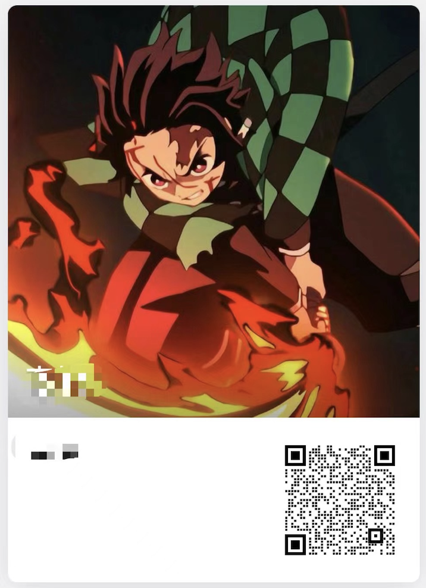
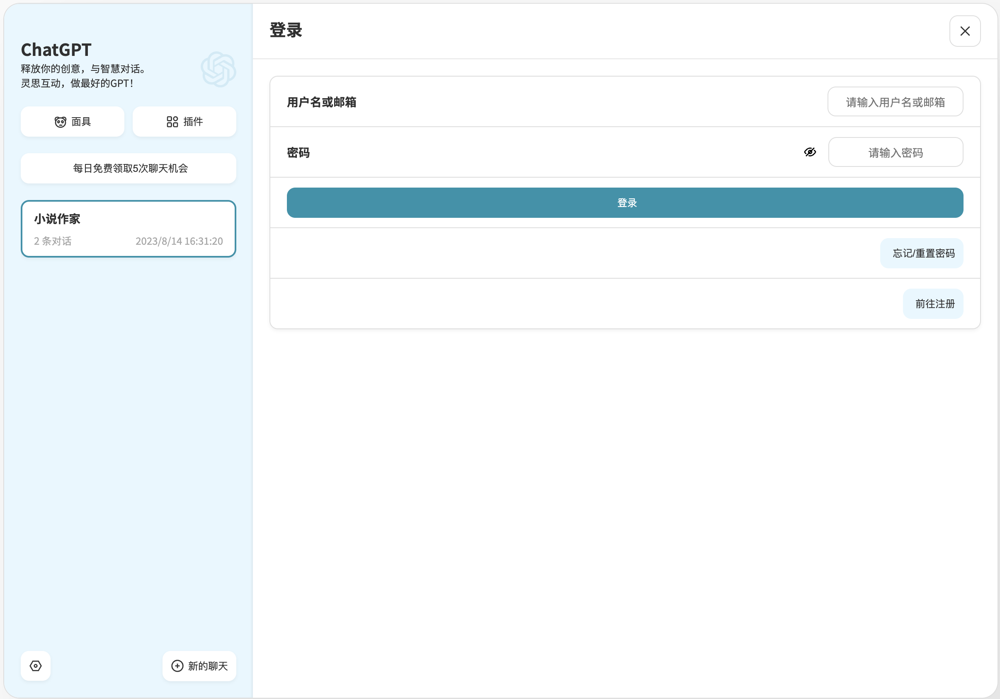
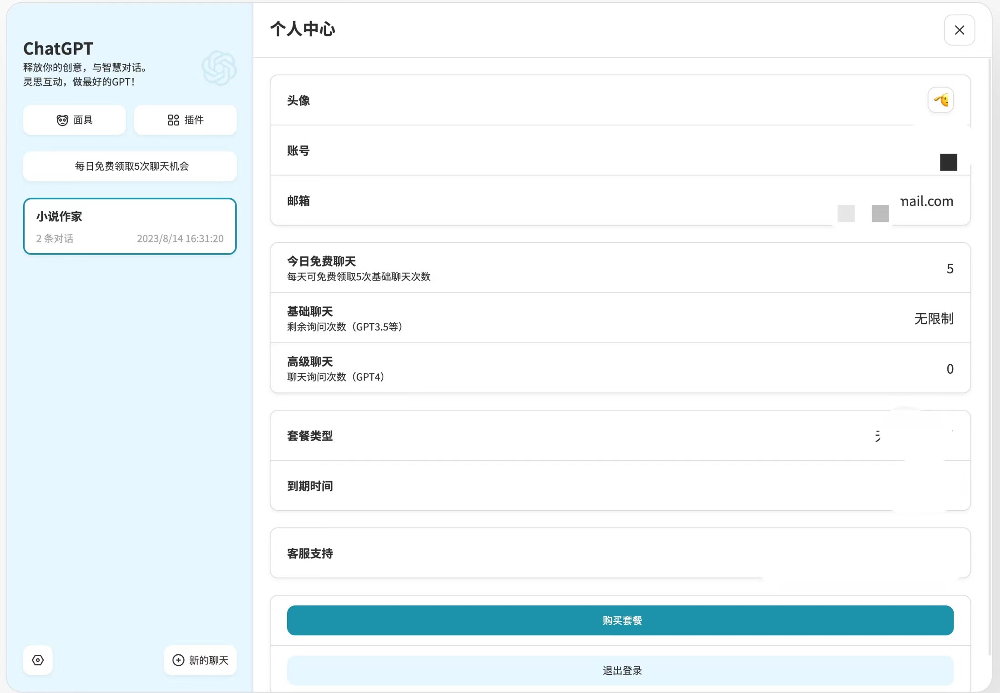
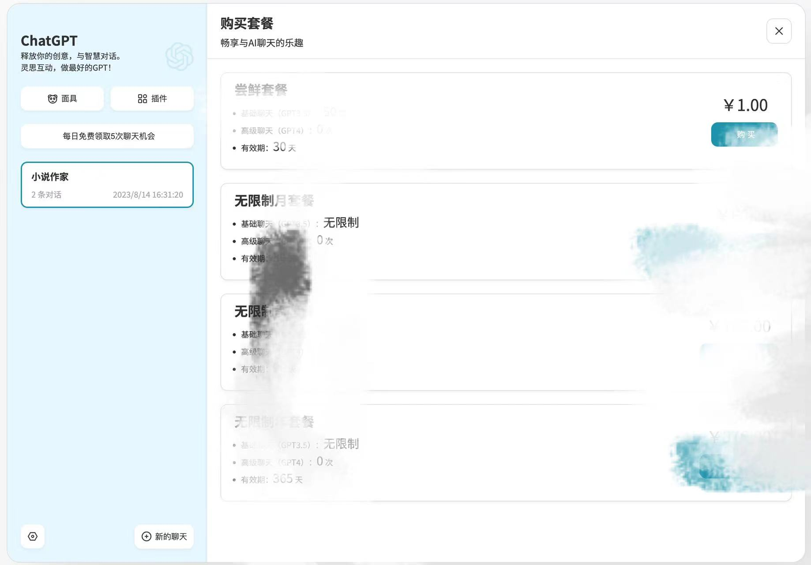
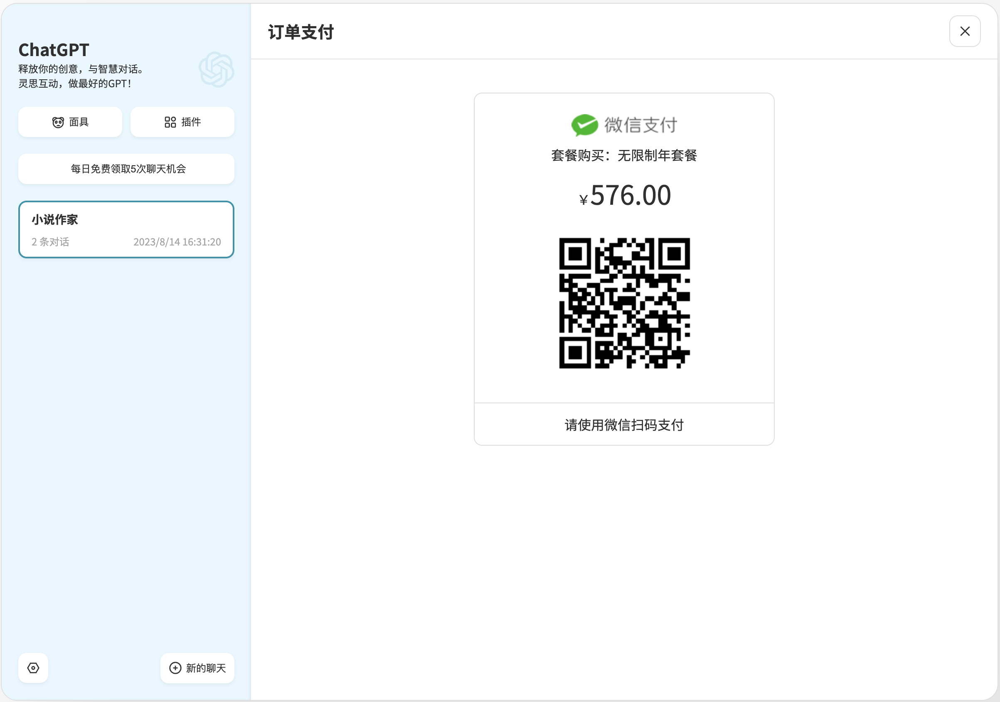
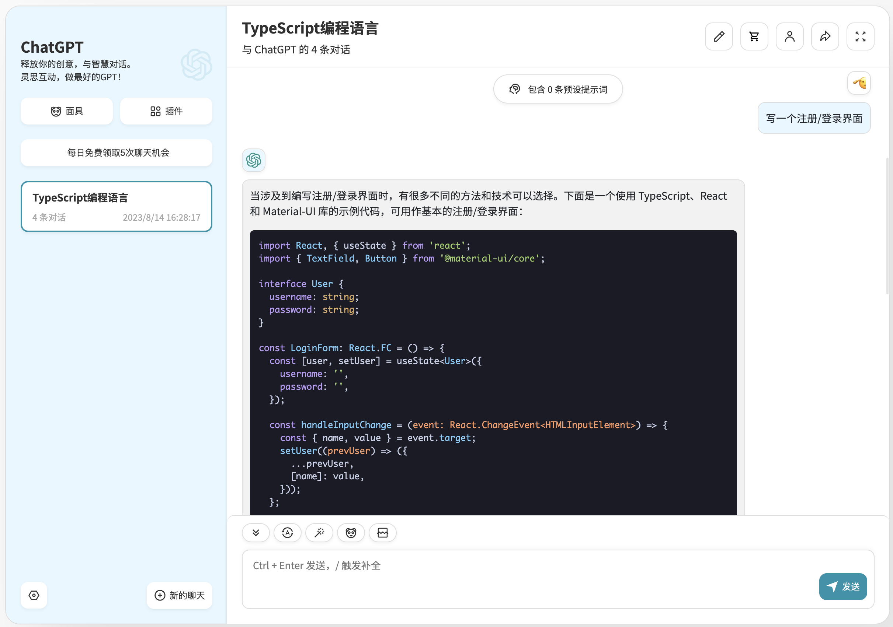
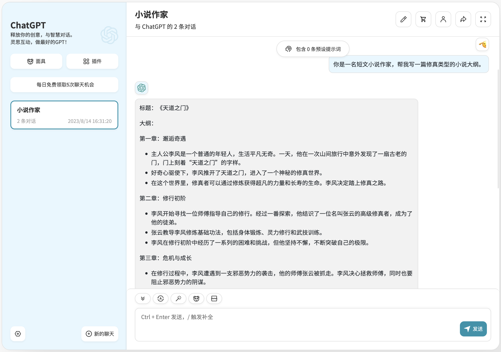

# 灵思互动

体验入口：[https://chat.huggingprompt.com/](https://chat.huggingprompt.com/)

ChatGPT国内版，自己搭建。

已跑通全流程，主要包括：

- 前端，账号体系、微信支付系统。
- 后端，OpenAi代理接口，支持stream。
- 支付套餐，访问次数。

## AIGC方向

可提供源码，欢迎一起研究探讨。

## 前端

前端采用 [ChatGPT-Next-Web](https://github.com/Yidadaa/ChatGPT-Next-Web) 的二次开发，感谢该项目的开发团队。

## 后端

后端采用Python Flask搭建。

## 微信支付

微信支付采用Java Spring Boot环境搭建，因微信支付提供了java版本的SDK。

## 数据库

数据库采用Redis。

